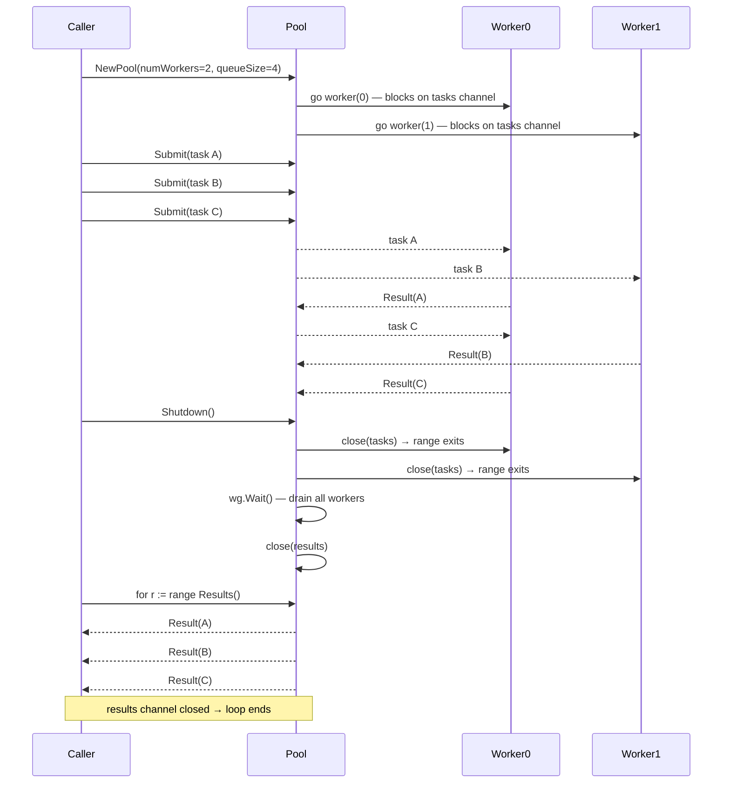
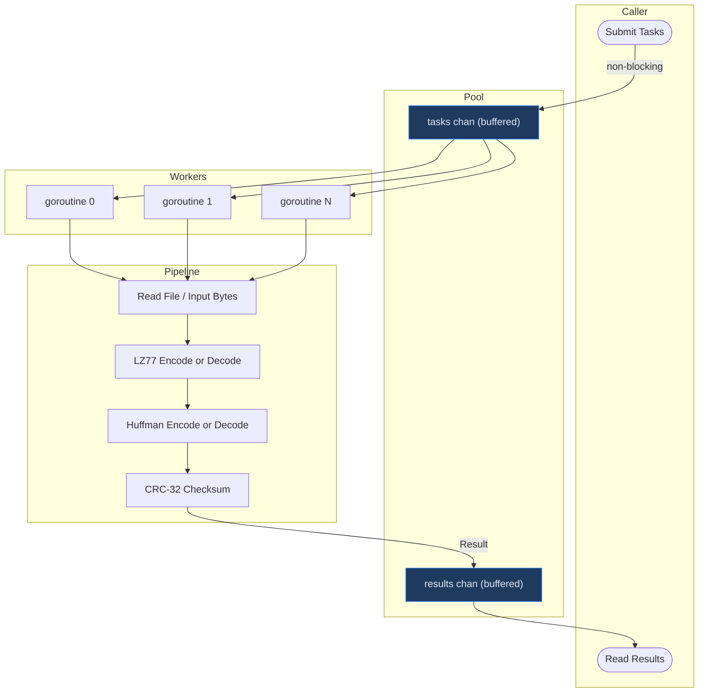

# go-zipper

A Go-based file compression and decompression utility exposing a RESTful HTTP API. The project implements a two-stage compression pipeline combining LZ77 tokenization and Huffman encoding, packaged into a custom archive format with CRC checksum verification.

---

## Table of Contents

- [Project Structure](#project-structure)
- [Architecture](#architecture)
  - [Compression Pipeline](#compression-pipeline)
  - [Decompression Pipeline](#decompression-pipeline)
  - [Worker Pool](#worker-pool)
  - [Archive Format Layout](#archive-format-layout)
- [Installation and Setup](#installation-and-setup)
- [Configuration](#configuration)
- [Usage Guide](#usage-guide)
- [Features](#features)
- [Contributing](#contributing)

---

## Project Structure

```
go-zipper/
├── main.go                          # Entry point; initializes and starts the HTTP server
├── go.mod                           # Module definition and dependency declarations
├── go.sum                           # Dependency checksums
│
├── api/                             # HTTP layer: routing and request handlers
│   ├── server.go                    # Server struct, startup, and graceful shutdown logic
│   ├── router.go                    # Route definitions using the chi router
│   ├── handlers.go                  # Handler functions for compress and decompress endpoints
│   └── middleware.go                # Shared middleware (logging, recovery, etc.)
│
├── archive/                         # Archive format definition and orchestration
│   ├── archive.go                   # Archive struct, metadata schema, and format constants
│   ├── pipeline.go                  # CompressData / DecompressData primitives used by CLI & pool
│   ├── writer.go                    # Encodes and writes compressed data to archive format
│   └── reader.go                    # Reads and validates archive files for decompression
│
├── worker/                          # Concurrent goroutine pool
│   ├── task.go                      # Task struct, TaskType constants, Validate()
│   ├── result.go                    # Result struct and CompressionRatio / ToJSON helpers
│   ├── pool.go                      # Pool implementation: NewPool, Submit, Results, Shutdown
│   └── worker_test.go               # Unit + integration tests for the pool
│
├── compressor/
│   ├── huffman/                     # Huffman encoding and decoding
│   │   ├── huffman.go               # Tree construction, encoding table generation
│   │   ├── encoder.go               # Bitstream encoding using the Huffman tree
│   │   └── decoder.go               # Bitstream decoding back to token stream
│   │
│   └── lz77/                        # LZ77 sliding window compression
│       ├── lz77.go                  # Core LZ77 algorithm: tokenization and back-reference resolution
│       ├── encoder.go               # Serializes LZ77 tokens to byte sequences
│       └── decoder.go               # Deserializes byte sequences back to LZ77 tokens
│
└── utils/                           # Shared utilities
    ├── fileutils.go                 # File reading, writing, and multipart form helpers
    └── checksum.go                  # CRC checksum computation and verification
```

### Package Descriptions

| Package | Responsibility |
|---|---|
| `api/` | Defines the HTTP server, registers routes via the `chi` router, and implements handlers that bridge HTTP requests to the compression logic. |
| `archive/` | Owns the custom archive format. The writer serialises compressed payloads and metadata (filenames, sizes, checksums) into a single archive file. The reader parses and validates that format before decompression. |
| `compressor/huffman/` | Builds a Huffman tree from symbol frequencies, produces an encoding table, and performs bitstream encoding and decoding. |
| `compressor/lz77/` | Implements the LZ77 sliding-window algorithm. Produces a stream of literal/back-reference tokens during compression and resolves those tokens back to raw bytes during decompression. |
| `utils/` | Provides file I/O helpers and CRC checksum routines used by both the archive and API layers to ensure data integrity. |

---

## Architecture

### Compression Pipeline


### Decompression Pipeline


### System Architecture Overview


### Worker Pool

The `worker` package implements a fixed-size goroutine pool that compresses or decompresses multiple files **concurrently** without blocking the caller. It is used by both the CLI `compress` command (via `worker.NewPool`) and is available to any future parallel workload.

#### Why a Worker Pool?

Processing files one by one is simple but slow when many files are involved. A worker pool keeps a fixed number of goroutines alive and feeds them work through a buffered channel. The caller submits tasks non-blocking and reads results whenever it's ready — the pool handles all the concurrency internally.

#### Pool Lifecycle



#### Data Flow Through the Pool



#### Channel Anatomy

```
NewPool(numWorkers=3, queueSize=4)

  tasks channel  [████░░░░]  capacity: 4   (buffered — Submit never blocks unless full)
                  ↑↑↑↑
              submitted tasks

  goroutines     [G0] [G1] [G2]            (always alive, blocking on tasks channel)
                   ↓    ↓    ↓
  results channel [████████]  capacity: 4  (buffered — workers never block writing results)
                       ↓
                  caller reads via Results()

  Submit()       — non-blocking select; returns error if tasks channel is full
  Shutdown()     — closes tasks, wg.Wait(), closes results  (sync.Once — safe to call twice)
  Results()      — returns receive-only <-chan Result; range exits when channel closes
```

#### Structs and Functions

##### `task.go`

| Symbol | Kind | Description |
|--------|------|-------------|
| `TaskType` | `string` type | Typed constant — prevents raw string mistakes (`"compress"` / `"decompress"`) |
| `TaskCompress` | const | Signals the worker to read `InputPath` from disk and compress it |
| `TaskDecompress` | const | Signals the worker to decompress `InputData` bytes already in memory |
| `Task` | struct | A single unit of work submitted to the pool |
| `Task.ID` | field | Unique identifier — returned in `Result.TaskID` so you can match results to inputs |
| `Task.Type` | field | `TaskCompress` or `TaskDecompress` |
| `Task.InputPath` | field | File path on disk — used only for compress tasks |
| `Task.InputData` | field | Raw compressed bytes — used only for decompress tasks |
| `Task.OutputPath` | field | Optional destination path (used by the caller, not the pool itself) |
| `Task.Metadata` | field | `map[string]string` key-value bag; pool stores the computed CRC-32 here |
| `Task.Validate()` | method | Pre-flight check: ID non-empty, correct input field set for the given type |

##### `result.go`

| Symbol | Kind | Description |
|--------|------|-------------|
| `Result` | struct | Everything the caller needs after a task completes |
| `Result.TaskID` | field | Echoes `Task.ID` — used to correlate result to the original task |
| `Result.Output` | field | Compressed bytes (compress) or restored bytes (decompress) |
| `Result.Err` | field | Non-nil if anything failed; always check before using `Output` |
| `Result.BytesIn` | field | Bytes entering the pipeline (original file size or compressed size) |
| `Result.BytesOut` | field | Bytes leaving the pipeline (compressed size or restored size) |
| `Result.DurationMs` | field | Wall-clock milliseconds the task took |
| `Result.WorkerID` | field | Which goroutine processed this task |
| `CompressionRatio()` | method | `BytesOut / BytesIn` — values below `1.0` mean the data shrank |
| `IsSuccess()` | method | `true` when `Err == nil`; use this as the first check on every result |
| `ToJSON()` | method | JSON-encodes metadata only (excludes `Output` bytes); safe for logging/status APIs |

##### `pool.go`

| Symbol | Kind | Description |
|--------|------|-------------|
| `Pool` | struct | The pool itself — holds the two buffered channels, WaitGroup, and Once |
| `Pool.tasks` | `chan Task` | Buffered job queue — workers read from here |
| `Pool.results` | `chan Result` | Buffered output queue — workers write here, caller reads |
| `Pool.wg` | `sync.WaitGroup` | Tracks live workers so `Shutdown` can wait for them all |
| `Pool.once` | `sync.Once` | Ensures `Shutdown` logic runs exactly once even if called concurrently |
| `NewPool(n, q)` | func | Starts `n` goroutines with a job buffer of size `q`; returns immediately |
| `Submit(task)` | method | Non-blocking enqueue via `select/default`; returns error if queue is full |
| `Results()` | method | Returns a receive-only `<-chan Result`; range over it to consume all results |
| `Shutdown()` | method | Closes `tasks` → workers drain and exit → `wg.Wait()` → closes `results` |
| `worker(id)` | private | Goroutine body: range over `tasks`, call `process`, send to `results` |
| `process(id, task)` | private | Dispatches to compress or decompress; wraps with panic recovery and timing |
| `processCompress` | private | Reads file → CRC-32 → LZ77.Encode → SerializeTokens → Huffman.Encode |
| `processDecompress` | private | Huffman.Decode → DeserializeTokens → LZ77.Decode |

#### Panic Safety

Every task runs inside a `defer recover()`. If any stage of the DEFLATE pipeline panics (nil pointer, out-of-bounds slice, etc.) the panic is caught, converted into a normal `Result.Err`, and emitted on the results channel. **The pool never crashes** — it keeps processing the remaining tasks.

#### Typical Usage Pattern

```go
pool := worker.NewPool(4, len(files))   // 4 goroutines, buffer = number of files

for i, path := range files {
    pool.Submit(worker.Task{
        ID:        strconv.Itoa(i),
        Type:      worker.TaskCompress,
        InputPath: path,
    })
}

go pool.Shutdown()  // signal no more tasks; closes results when done

for result := range pool.Results() {
    if !result.IsSuccess() {
        log.Printf("task %s failed: %v", result.TaskID, result.Err)
        continue
    }
    fmt.Printf("compressed %d → %d bytes\n", result.BytesIn, result.BytesOut)
}
```

---

### Archive Format Layout

Each archive produced by go-zipper follows this binary layout:

```
+------------------+
|  Magic Header    |  4 bytes  – format identifier
+------------------+
|  Version         |  1 byte   – archive format version
+------------------+
|  File Count      |  4 bytes  – number of contained files
+------------------+
|  [ File Entry ]  |  repeated for each file:
|    Filename Len  |  2 bytes
|    Filename      |  variable
|    Original Size |  8 bytes
|    Payload Size  |  8 bytes
|    CRC Checksum  |  4 bytes
|    Payload       |  variable – Huffman-encoded LZ77 token stream
+------------------+
```

---

## Installation and Setup

### Prerequisites

| Requirement | Version |
|---|---|
| Go | 1.21 or later |
| chi router | v5.x |

### Clone and Build

```bash
# Clone the repository
git clone https://github.com/your-org/go-zipper.git
cd go-zipper

# Download dependencies
go mod download

# Build the binary
go build -o go-zipper ./...

# Run the binary
./go-zipper
```

### Run Directly with Go

```bash
go run main.go
```

### Run Tests

```bash
go test ./...
```

---

## Configuration

The server is configured through environment variables and has sensible defaults when none are provided.

| Variable | Default | Description |
|---|---|---|
| `PORT` | `8080` | TCP port the HTTP server listens on |
| `HOST` | `0.0.0.0` | Network interface to bind |

### Example Environment Configuration

```bash
export PORT=9090
./go-zipper
```

### Server Options (Programmatic)

The `api.Server` struct accepts the following options:

```go
type Server struct {
    Host    string  // Network interface (default: "0.0.0.0")
    Port    string  // Port number     (default: "8080")
    Version string  // API version     (default: "v1")
}
```

### Graceful Shutdown

The server listens for `SIGINT` and `SIGTERM` signals. Upon receiving either signal, it stops accepting new connections and waits for in-flight requests to complete before exiting. The shutdown timeout is configurable within `api/server.go`.

```
Signal received (SIGINT / SIGTERM)
        |
        v
Stop accepting new connections
        |
        v
Wait for active requests (timeout: 30s)
        |
        v
Release resources and exit cleanly
```

---

## Usage Guide

### API Endpoints

#### `GET /health`

Returns the health status of the server. Use this endpoint to verify the service is running and responsive.

**Request**

```bash
curl -X GET http://localhost:8080/health
```

**Response**

```json
{
  "status": "ok"
}
```

---

#### `POST /compress`

Accepts one or more files via a `multipart/form-data` request and returns a single compressed archive.

**Constraints**

- Maximum request body size: 32 MB
- Content-Type must be `multipart/form-data`
- Files must be supplied under the form field name `files`

**Request**

```bash
curl -X POST http://localhost:8080/compress \
  -F "files=@document.txt" \
  -F "files=@image.png" \
  --output archive.fzp
```

**Response**

On success, the server responds with HTTP `200` and streams the archive binary as the response body.

| Header | Value |
|---|---|
| `Content-Type` | `application/octet-stream` |
| `Content-Disposition` | `attachment; filename="archive.fzp"` |
| `Content-Length` | `integer` |

**Error Responses**

| Status | Reason |
|---|---|
| `400 Bad Request` | Missing or malformed multipart form data |
| `413 Request Entity Too Large` | Upload exceeds the 32 MB limit |
| `500 Internal Server Error` | Compression or archive writing failure |

---

#### `POST /decompress`

Accepts a previously created go-zipper archive and returns the decompressed files. If the archive contains multiple files, the response is a ZIP bundle of the reconstructed files.

**Request**

```bash
curl -X POST http://localhost:8080/decompress \
  -F "file=@archive.fzp" \
  --output decompressed.fzp.
```

**Response**

On success, the server responds with HTTP `200` and streams the decompressed content.

| Header | Value |
|---|---|
| `Content-Type` | `application/octet-stream` |
| `Content-Disposition` | `attachment; filename="decompressed.fzp"` |
| `Content-Length` | `integer` |

**Error Responses**

| Status | Reason |
|---|---|
| `400 Bad Request` | No archive file provided, or file is not a valid go-zipper archive |
| `422 Unprocessable Entity` | CRC checksum mismatch; archive is corrupt |
| `500 Internal Server Error` | Decompression or file reconstruction failure |

---

### Request and Response Format Summary

```
POST /compress
  Content-Type: multipart/form-data
  Body:         files[] -> binary file uploads
  Response:     application/octet-stream (archive binary)

POST /decompress
  Content-Type: multipart/form-data
  Body:         file   -> single archive binary
  Response:     application/octet-stream (decompressed content)

GET /health
  Response:     application/json
```

---

## Features

### Two-Stage Compression

go-zipper applies compression in two sequential stages:

1. **LZ77 Encoding** — A sliding-window algorithm scans the input and replaces repeated byte sequences with back-references `(offset, length)`. This reduces structural redundancy in the data stream before any entropy coding is applied.

2. **Huffman Encoding** — The token stream produced by LZ77 is analysed for symbol frequency. A Huffman tree is constructed and used to assign shorter bit codes to more frequent symbols, yielding further size reduction through optimal entropy coding.

This combination is effective on text-heavy files and structured binary data. The achievable compression ratio depends on the entropy and repetition characteristics of the input.

### CRC Checksum Verification

Each file entry in the archive stores a CRC-32 checksum computed from the original uncompressed data. During decompression, the checksum is recomputed and compared against the stored value. Any mismatch causes the operation to abort with an error, protecting against silent data corruption caused by transmission errors or storage faults.

### Custom Archive Format

The archive format is self-describing: it embeds filenames, original sizes, compressed payload sizes, and checksums for each file entry. This allows the decompressor to validate and reconstruct files independently without relying on external metadata or sidecar files.

### Multiple File Support

A single compress request may include multiple files. All files are encoded and stored within one archive. During decompression, all original files are reconstructed from that single archive in their original form.

### Concurrent Worker Pool

File compression is CPU-bound. The `worker` package provides a **fixed-size goroutine pool** that processes multiple files in parallel, making full use of available CPU cores. Key properties:

- **Non-blocking submission** — `Submit()` uses a `select/default` pattern and returns an error immediately if the queue is full, so the caller is never blocked.
- **Ordered results** — workers return results as they finish; the CLI maps results back to input order using `Task.ID`.
- **Panic-safe** — any pipeline panic is caught by a `defer recover()` inside each worker and converted to a `Result.Err`, keeping the pool alive.
- **Clean shutdown** — `Shutdown()` closes the task channel, waits for all in-flight work to complete via `sync.WaitGroup`, then closes the results channel, allowing callers to range cleanly over `Results()`.

### RESTful HTTP API

All functionality is exposed over HTTP using standard request and response conventions. The server requires no client-side libraries; any HTTP client capable of sending multipart form data — including curl, Postman, or custom application code — can interact with the API.

### Graceful Shutdown

The server handles OS termination signals cleanly, completing any active requests before releasing resources and exiting. This makes go-zipper suitable for deployment in container-orchestrated environments where rolling restarts and zero-downtime deployments are expected.

---
